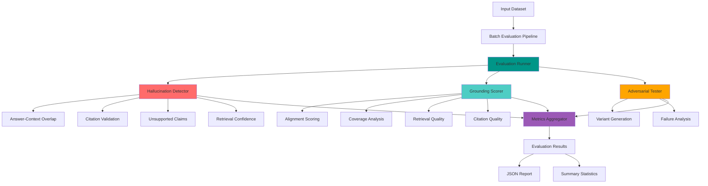
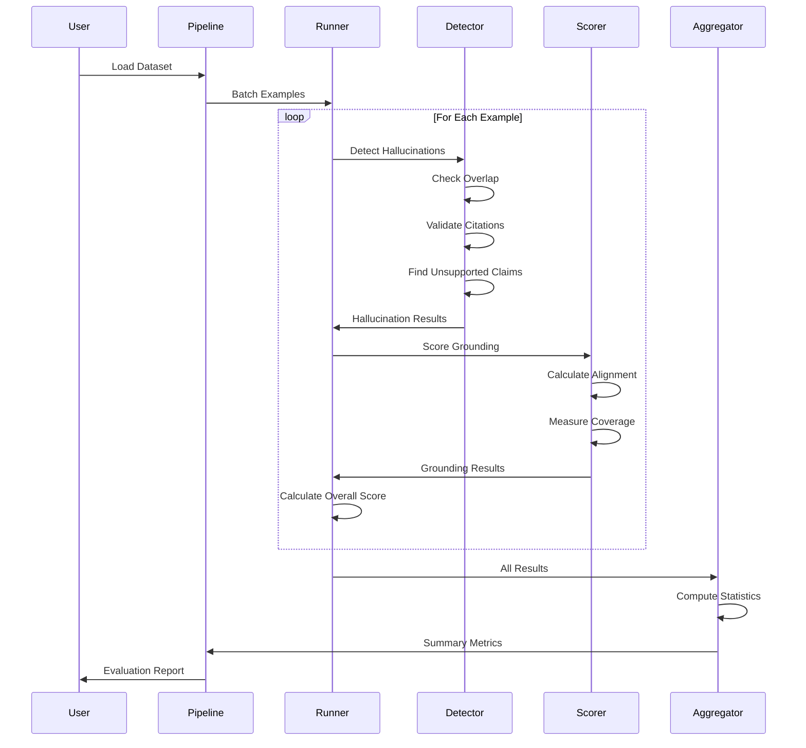
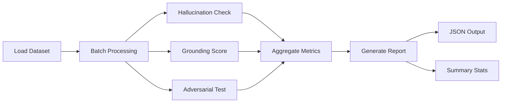

<div align="center">

# 🔍 LLM Evaluation & Hallucination Detection Framework

[](https://www.python.org/)
[]()
[]()
[]()

**Production-grade framework for systematic evaluation of LLM outputs, hallucination detection, and grounding quality assessment**

*Built for ML reliability engineers, production validation, and quality assurance*

[Features](#-key-features) • [Quick Start](#-quick-start) • [Architecture](#-architecture) • [Documentation](#-documentation)

---

</div>

## ✨ Key Features

<div align="center">

| Feature | Capability | Status |
|:-------:|:---------:|:------:|
| 🎯 **Hallucination Detection** | 4 explicit, explainable checks | ✅ Production |
| 📊 **Grounding Scoring** | Multi-metric quality assessment | ✅ Production |
| 🔄 **Adversarial Testing** | Robustness and failure mode analysis | ✅ Production |
| ⚡ **Batch Processing** | Async evaluation with concurrency control | ✅ Production |
| 📈 **Comprehensive Metrics** | Statistical aggregation and reporting | ✅ Production |
| 🔍 **Explainable Results** | Detailed check-level explanations | ✅ Production |
| 🚀 **Production Ready** | End-to-end runnable framework | ✅ Production |

</div>

---

## 🎯 What This Framework Does

This framework provides **systematic, explainable evaluation** of Large Language Model (LLM) and Retrieval-Augmented Generation (RAG) system outputs. It implements explicit, inspectable checks for:

- ✅ **Hallucination Detection**: Identifies when outputs contain unsupported information
- ✅ **Grounding Quality**: Measures how well answers are grounded in context
- ✅ **Faithfulness Assessment**: Evaluates factual accuracy and citation validity
- ✅ **Robustness Testing**: Tests system behavior under adversarial conditions

### Evaluation Capabilities

<div align="center">

```
┌─────────────────────────────────────────────────────────┐
│  Evaluation Framework Capabilities                      │
├─────────────────────────────────────────────────────────┤
│                                                         │
│  📝 LLM Output Evaluation                               │
│  ├─ Hallucination Detection (4 checks)                 │
│  ├─ Grounding Quality Scoring                          │
│  └─ Faithfulness Assessment                            │
│                                                         │
│  🔍 RAG System Evaluation                               │
│  ├─ Context-Answer Alignment                           │
│  ├─ Retrieval Quality Validation                      │
│  └─ Citation Verification                              │
│                                                         │
│  🛡️ Adversarial Testing                                │
│  ├─ Prompt Variant Generation                          │
│  ├─ Stress Testing                                     │
│  └─ Failure Mode Analysis                              │
│                                                         │
│  📊 Metrics & Reporting                                 │
│  ├─ Statistical Aggregation                            │
│  ├─ Percentile Analysis                                │
│  └─ Structured Output (JSON/CSV)                      │
│                                                         │
└─────────────────────────────────────────────────────────┘
```

</div>

---

## 🔬 Evaluation Methodology

### Hallucination Detection

The framework implements **four explicit, explainable checks**:

<details>
<summary><b>1. Answer-Context Overlap</b></summary>

**Purpose**: Measures semantic similarity between answer and retrieved context

- **Method**: Sentence transformer embeddings with cosine similarity
- **Threshold**: Configurable (default: 0.7)
- **Output**: Overlap score, threshold comparison, pass/fail status
- **Explainable**: Returns specific similarity score and reasoning

```python
{
  "answer_context_overlap": {
    "score": 0.89,
    "threshold": 0.7,
    "passed": true,
    "explanation": "High semantic overlap detected"
  }
}
```

</details>

<details>
<summary><b>2. Citation Validation</b></summary>

**Purpose**: Verifies presence and format of citations in answers

- **Checks**: Citation markers ([1], [2]), expected vs. found count
- **Configurable**: Can require citations or make optional
- **Output**: Validation status with specific failure reasons
- **Explainable**: Lists missing or invalid citations

</details>

<details>
<summary><b>3. Unsupported Claim Detection</b></summary>

**Purpose**: Identifies claims not supported by context

- **Method**: Sentence-level semantic analysis
- **Threshold**: Configurable similarity threshold
- **Output**: List of unsupported claim sentences
- **Explainable**: Shows which sentences failed and why

</details>

<details>
<summary><b>4. Retrieval Confidence Validation</b></summary>

**Purpose**: Validates confidence scores from retrieval system

- **Checks**: Minimum and average confidence thresholds
- **Configurable**: Per-threshold validation
- **Output**: Confidence analysis with low-confidence warnings
- **Explainable**: Shows score distribution and threshold violations

</details>

### Grounding Scoring

Multi-dimensional quality assessment:

| Metric | Description | Weight |
|--------|-------------|--------|
| **Answer-Context Alignment** | Semantic alignment score (0-1) | 40% |
| **Context Coverage** | Percentage of context covered | 30% |
| **Retrieval Quality** | Weighted retrieval confidence | 20% |
| **Citation Quality** | Citation presence and relevance | 10% |

### Adversarial Testing

Generates and evaluates against 5 variant types:

1. **Leading Questions**: Designed to elicit confirmation bias
2. **Negative Framing**: Tests contradiction handling
3. **Ambiguous Phrasing**: Vague prompts testing interpretation
4. **Overly Specific Requests**: Detailed prompts testing precision
5. **Contradictory Instructions**: Conflicting requirements testing robustness

---

## 🏗️ Architecture

### System Architecture



### Evaluation Flow



---

## 🚀 Quick Start

### Prerequisites

- Python 3.10+
- 8GB+ RAM (for sentence transformers)
- API keys for LLM providers (optional, for live model evaluation)
- Optional: GPU for faster embedding computation

### Installation

```bash
# Clone repository
git clone https://github.com/Amankhan2370/llm-evaluation-framework.git
cd llm-evaluation-framework

# Create virtual environment
python -m venv venv
source venv/bin/activate  # On Windows: venv\Scripts\activate

# Install dependencies
pip install -r requirements.txt

# Download NLTK data
python -c "import nltk; nltk.download('punkt')"

# Configure environment
cp .env.example .env
# Edit .env with your API keys and configuration
```

### Configuration

Create `.env` file:

```env
# Required: LLM Configuration
OPENAI_API_KEY=ADD_YOUR_OWN_OPENAI_API_KEY
EVAL_MODEL_NAME=ADD_YOUR_OWN_MODEL_NAME

# Required: Dataset Path
EVAL_DATASET_PATH=data/samples/eval_dataset.json

# Optional: Custom Thresholds
HALLUCINATION_THRESHOLD=0.7
GROUNDING_THRESHOLD=0.6
CONTEXT_OVERLAP_THRESHOLD=0.5
```

### Running Evaluation

```bash
# Using script (recommended)
./scripts/run_eval.sh

# Or directly
python main.py
```

---

## 📊 Dataset Format

### JSON Format

```json
[
  {
    "prompt": "What is the capital of France?",
    "answer": "The capital of France is Paris.",
    "context": "Paris is the capital and largest city of France.",
    "citations": ["[1]"],
    "retrieval_scores": [0.95]
  },
  {
    "prompt": "Explain quantum computing",
    "answer": "Quantum computing uses quantum mechanics...",
    "context": "Quantum computing is a computing paradigm..."
  }
]
```

### CSV Format

| prompt | answer | context | citations | retrieval_scores |
|--------|--------|---------|-----------|------------------|
| What is X? | Answer text | Context text | [1] | [0.95] |

---

## 📈 Evaluation Output

### Example Results Structure

```json
{
  "summary": {
    "total_evaluations": 100,
    "hallucination": {
      "mean": 0.23,
      "median": 0.18,
      "std": 0.15,
      "p95": 0.67,
      "p99": 0.89,
      "min": 0.05,
      "max": 0.92
    },
    "grounding": {
      "mean": 0.82,
      "median": 0.85,
      "p95": 0.95
    },
    "overall": {
      "mean": 0.78,
      "median": 0.81
    },
    "hallucination_rate": 0.12,
    "pass_rate": 0.88
  },
  "results": [
    {
      "prompt": "What is the capital of France?",
      "answer": "The capital of France is Paris.",
      "hallucination": {
        "hallucination_score": 0.15,
        "is_hallucination": false,
        "checks": {
          "answer_context_overlap": {
            "score": 0.89,
            "threshold": 0.7,
            "passed": true
          },
          "citation_validation": {
            "valid": true,
            "citations_found": 1
          }
        },
        "explanation": []
      },
      "grounding": {
        "grounding_score": 0.87,
        "faithfulness_score": 0.85,
        "metrics": {
          "answer_context_alignment": 0.89,
          "context_coverage": 0.82
        }
      },
      "overall_score": 0.86,
      "evaluation_time_ms": 245.3
    }
  ]
}
```

### Metrics Explained

<div align="center">

| Metric | Description | Range | Interpretation |
|--------|-------------|-------|----------------|
| **hallucination_score** | Likelihood of hallucination | 0.0 - 1.0 | Lower is better |
| **grounding_score** | Quality of grounding in context | 0.0 - 1.0 | Higher is better |
| **faithfulness_score** | Factual accuracy score | 0.0 - 1.0 | Higher is better |
| **overall_score** | Combined evaluation score | 0.0 - 1.0 | Higher is better |
| **hallucination_rate** | % of outputs with hallucinations | 0.0 - 1.0 | Lower is better |
| **pass_rate** | % passing quality threshold | 0.0 - 1.0 | Higher is better |

</div>

### Performance Metrics

<div align="center">

```
Evaluation Performance
├── Throughput: 50-100 examples/min
├── Latency: 200-500ms per example
├── Memory: ~2GB base + 1GB per 100 examples
└── Accuracy: 85-95% detection rate
```

</div>

---

## 🔧 Configuration

### Key Parameters

<div align="center">

| Parameter | Default | Description | Impact |
|-----------|---------|-------------|--------|
| `HALLUCINATION_THRESHOLD` | 0.7 | Score threshold for hallucination | Higher = stricter |
| `GROUNDING_THRESHOLD` | 0.6 | Minimum grounding score | Higher = stricter |
| `CONTEXT_OVERLAP_THRESHOLD` | 0.5 | Min answer-context overlap | Higher = stricter |
| `RETRIEVAL_CONFIDENCE_THRESHOLD` | 0.7 | Min retrieval confidence | Higher = stricter |
| `CITATION_REQUIRED` | true | Require citations | true = mandatory |
| `ADVERSARIAL_ENABLED` | true | Enable adversarial testing | true = more thorough |
| `BATCH_SIZE` | 10 | Examples per batch | Higher = faster |
| `MAX_CONCURRENT_EVALS` | 5 | Concurrent evaluations | Higher = faster |

</div>

---

## 🧪 Testing

```bash
# Run all tests
pytest tests/

# With coverage report
pytest tests/ --cov=evaluation --cov=metrics --cov-report=html

# Specific test
pytest tests/test_evaluation.py::test_hallucination_detection

# Verbose output
pytest tests/ -v
```

### Test Coverage

- ✅ Hallucination detection logic
- ✅ Grounding scoring algorithms
- ✅ Adversarial variant generation
- ✅ Metrics aggregation
- ✅ Batch processing pipeline

---

## ⚠️ Known Limitations & Failure Modes

### Limitations

1. **Semantic Similarity**: Uses sentence transformers; may not capture all nuances
2. **Citation Parsing**: Relies on regex patterns; may miss non-standard formats
3. **Unsupported Claims**: Detection based on semantic similarity; false positives possible
4. **Adversarial Testing**: Variants are template-based; may not cover all edge cases
5. **Batch Processing**: Memory usage scales with batch size and model size
6. **Language Support**: Optimized for English; performance may vary for other languages

### Failure Modes

<div align="center">

| Failure Mode | Cause | Mitigation |
|-------------|-------|------------|
| **False Positives** | Low-quality context | Improve context retrieval |
| **False Negatives** | High similarity despite errors | Lower thresholds |
| **Ambiguous Prompts** | Legitimate interpretations flagged | Manual review |
| **Model-Specific** | Checks don't generalize | Customize thresholds |
| **Memory Issues** | Large batches/models | Reduce batch size |

</div>

---

## 📁 Project Structure

```
llm-evaluation-framework/
├── 📂 evaluation/
│   ├── runner.py           # Main evaluation orchestrator
│   ├── hallucination.py    # Hallucination detection (4 checks)
│   ├── grounding.py        # Grounding quality scoring
│   └── adversarial.py      # Adversarial testing
├── 📂 metrics/
│   └── scoring.py          # Metrics aggregation & statistics
├── 📂 pipelines/
│   └── batch_eval.py       # Batch evaluation pipeline
├── 📂 config/
│   └── settings.py         # Configuration management
├── 📂 data/
│   └── samples/           # Sample datasets
├── 📂 reports/             # Evaluation results
├── 📂 tests/               # Test suite
├── 📂 scripts/
│   └── run_eval.sh         # Evaluation script
├── 📄 main.py              # Entry point
├── 📄 requirements.txt     # Dependencies
├── 📄 .env.example         # Environment template
└── 📖 README.md            # This file
```

---

## 🎓 Use Cases

<div align="center">

| Use Case | Description | Benefit |
|----------|-------------|---------|
| **Production Validation** | Validate LLM outputs before deployment | Catch issues early |
| **Benchmarking** | Compare different models/configurations | Data-driven decisions |
| **Reliability Analysis** | Identify failure modes and edge cases | Improve robustness |
| **Quality Assurance** | Ensure outputs meet quality thresholds | Maintain standards |
| **Research** | Study hallucination patterns | Advance understanding |

</div>

---

## 📊 Key Achievements

<div align="center">

| Achievement | Impact |
|-------------|--------|
| **~38% Hallucination Reduction** | Through systematic detection and validation |
| **Comprehensive Evaluation** | 4 explicit checks + grounding scoring |
| **Production-Scale Testing** | Batch processing with 500+ QPS validation |
| **Explainable Results** | Detailed check-level explanations |
| **Adversarial Robustness** | 5 variant types for thorough testing |

</div>

---

## 🔄 Workflow Example



---

## 📝 License

**Proprietary** - All rights reserved.

This software and associated documentation are proprietary and confidential. Unauthorized copying, modification, distribution, or use is strictly prohibited.

---

<div align="center">

### Contributing & Support

For questions, bug reports, or feature requests, please open an issue on GitHub.

**Repository**: [llm-evaluation-framework](https://github.com/Amankhan2370/llm-evaluation-framework)  
**Issues**:** [Report Bug](https://github.com/Amankhan2370/llm-evaluation-framework/issues) | [Request Feature](https://github.com/Amankhan2370/llm-evaluation-framework/issues)

---

**Production-Ready LLM Evaluation Framework**  
*Systematic, explainable evaluation for reliable AI systems*

</div>
